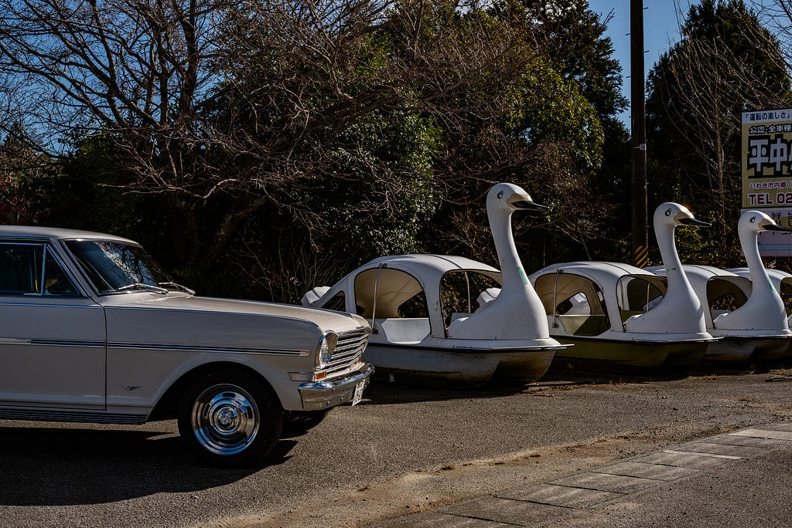
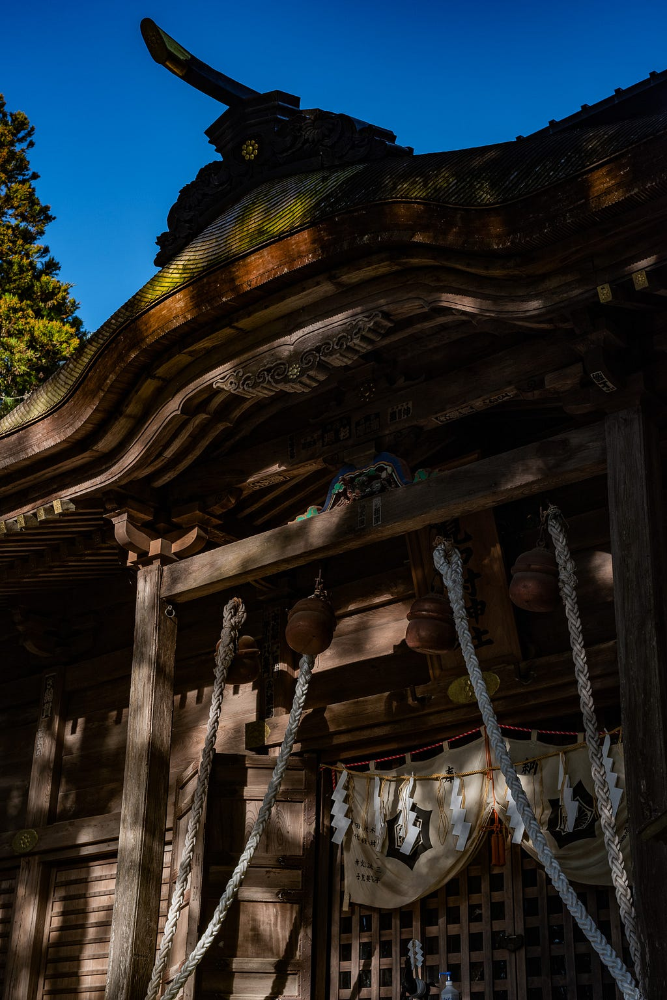
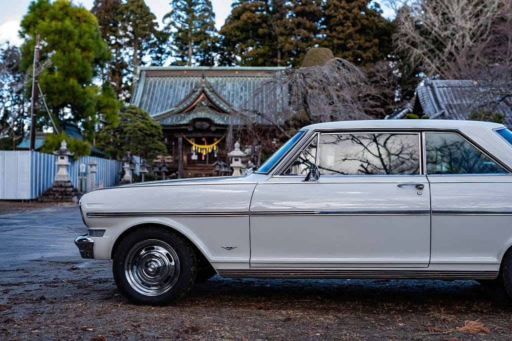
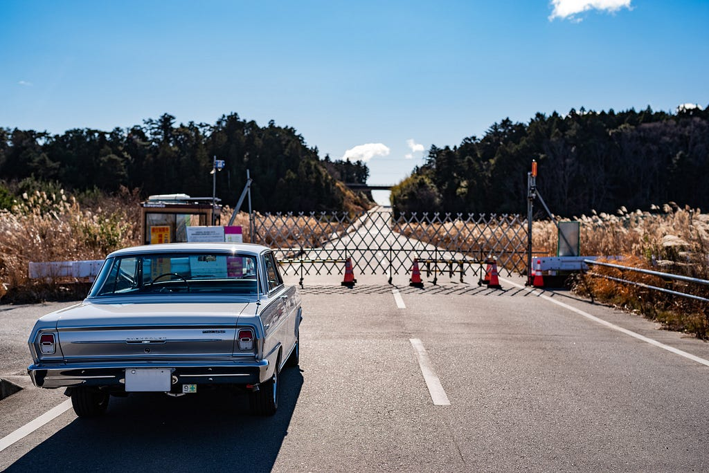

# Joban Highway

2023.01.11

以前勤めていた会社の拠点が福島県いわき市にあったため、よく車で出張しては、好間家という峠の定食屋さんでかつ丼を食べていた。すごくおいしい記憶があって、定休日の月曜に出張だとガッカリしたことが何度もある。そんなお店が年末の28日で閉店になるというのでクリスマスの週末に行って来た。まずは土曜クリスマスイブの夕食にかつ丼を食べて、少し北上した広野という町で一泊。

*道端にあったスワンボートと記念撮影*

広野駅前のホテルはきれいだったが、近くにあるJビレッジというサッカーの施設で合宿でもあるのか小学生の団体がいて大混雑だった。

翌朝更に北上して相馬まで行ってみた。相馬氏の主従関係は今でも続いているのか馬追いという行事などで有名で、一度どんなところか来てみたかったという。

*相馬中村神社*

3つの神社を車で回って、正月の準備をする氏子さんたちが忙しく働いてる中をカメラを持ってウロウロしてきた。相馬中村神社、相馬太田神社、相馬小高神社の3つで相馬三妙見社というらしい。相馬氏はもとを辿ると平将門といわれていて、もともとは千葉県北西部や茨城県南西部あたりが地盤。そういえば相馬郡というのがあのあたりにあったなと。

*相馬小高神社では境内まで車で入れた。*

そのあと福島第一原発の辺りまで行ってみたり、ネットで見て気になっていた、建築設計事務所が趣味で始めた車コレクションの展示場、オールドカーセンタークダンに行ってみた。6号線の原発に近いあたりは6号線の通行は出来るが海側は立ち入り禁止区域だったりするのでお店も開いていなくて不思議な光景だった。

*閉鎖された原発への道*

あちこちに放射線量の表示があったり、警備員がいたりしてまだまだあの時から何年も経っているにも関わらず終わっていないのだなというのを実感できた。

*オールドカーセンタークダンには飛行機も*

この車で神奈川から来たというと、オールドカーセンタークダンのおじさんは「ちょっとちょっと、まさかこの為に来たんじゃないよね？そんなたいそうな場所じゃないよ！」と笑っていた。昔団地の建築設計をする際にモジュールを組み立てていた工場をそのまま展示場にしていて、中にはたくさんの旧車が。全部エンジンは掛かるらしい。

ひとしきり見学した後、いわきまで戻って、昼にまた好間家に行って食事してから思い残すことのない状態にして帰路へ。

Nova凄くて、往復の間の燃費は9.8km/Lに達した。高速と信号のない田舎道をだらーっと走り続ける事で普段は5km/Lちょっとだというのに倍近く伸びてくれてガソリン高いので助かった。それと思うのはNovaの椅子全然腰やお尻が痛くならない。スゴイ。

---

**使用画像**: joban-swan.jpeg, joban-soma.jpeg, joban-odaka.jpeg, joban-npp.jpeg, joban-kudan1.jpeg, joban-kudan2.jpeg, joban-kudan3.jpeg, joban-kudan4.jpeg
