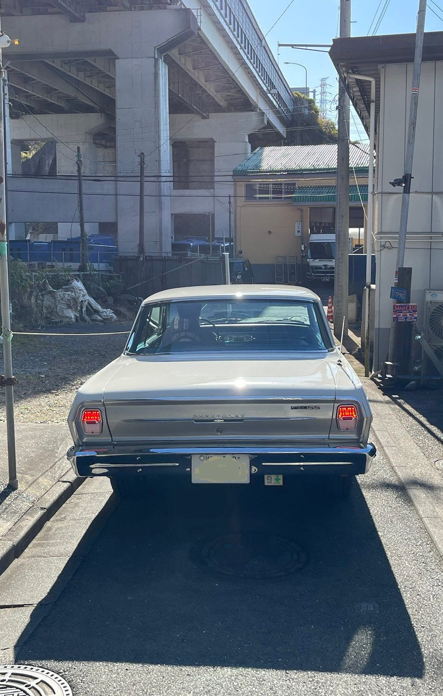
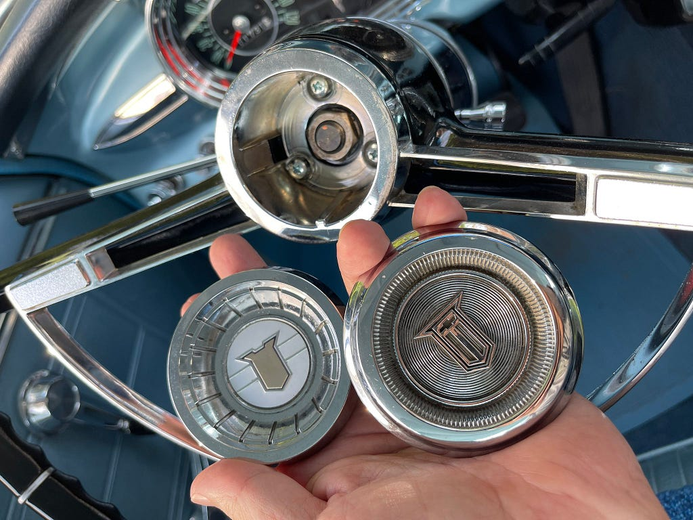
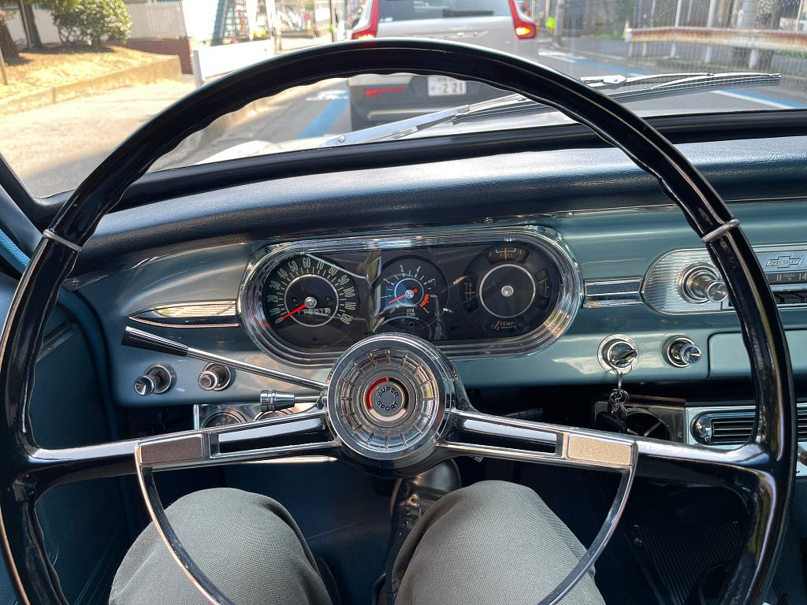

# 車検

2023.05.04

年末に車検だった。そのついでにLEDテールに変更してもらった。めっちゃ明るいし、ついでにソケットも変更したので接触不良もなくなって良い感じだと思う。

*純正の形のままLEDに*

ホーンボタンがどうも1965年の物らしく、これも1963年式に交換する。ついでにSS用ホーンボタンのパーツも注文した。1965年式の方がかっこいいような気もするが

*左が1963年、右が1965年*

*1963年式ホーンボタンに交換したあとSS用のパーツを入れて完成！*

---

**使用画像**: led-tail.jpeg, horn-compare.jpeg, horn-ss.jpeg
