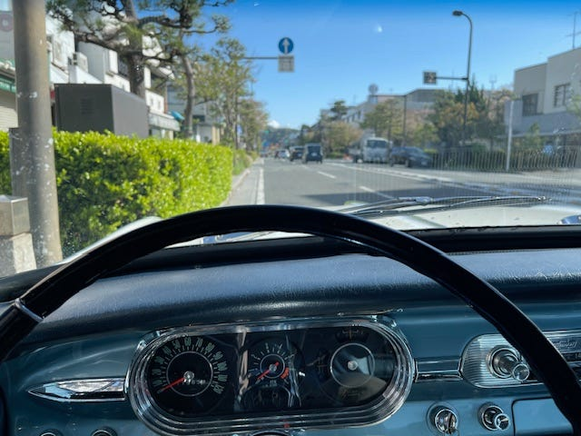
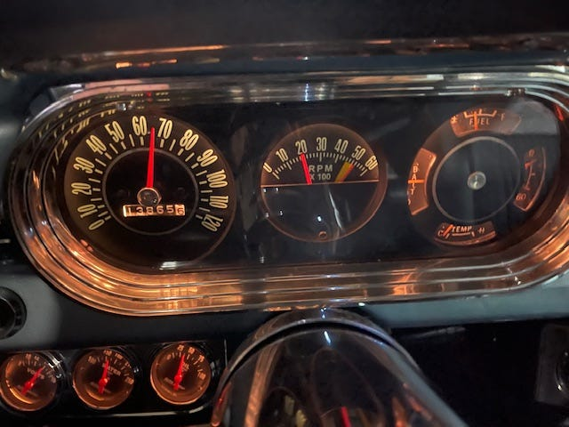
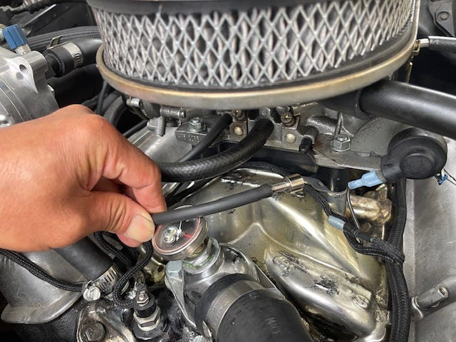

# クーラーの改善とタコメーター交換

2024.12.10（23年9月の修理）

夏の間にクーラーを何度か使ったがどうも効きが悪い。足元はむしろ熱い。なのでなんとかならないのかな？と思っていたのと、クーラーを付けている状態で信号などで止まると、アイドリングが不安定になることが多くてちょっと困っていました。夏はやはり暑いのでクーラー付けたいですし。なのでその部分を修理工場と相談してました。

そんな時に純正風の針が左右に振れるタイプのタコメーターを見つけて買ってしまいました。なので以前にメーターゲージ内の時計をタコメーターに変更してもらったのですが、更にタコメーターを交換します。

*Nova用だけど純正とは違うタコメーター*

*eBayで見つけた純正タコメーター*

ついでにあちこち見ていただいて、アイドリングの不安定さについてフューエルラインの問題でパーコレーションが起きているかもしれないので、そのホースのやり直しと、キャブレターとエンジンの間にスペーサーを入れて熱がキャブに伝わりにくくするなどの作業と、ラジエターホースの一部にもうすぐ裂けそうなところを見つけたので上下のホースの交換とヒーターの熱を夏は遮断して車内に来ないようにするなどもセットでお願いしました。

*キャブとエンジンの間の黒い板がスペーサー*

---

**使用画像**: tach-before.jpeg, tach-oem.jpeg, carb-spacer.jpeg
