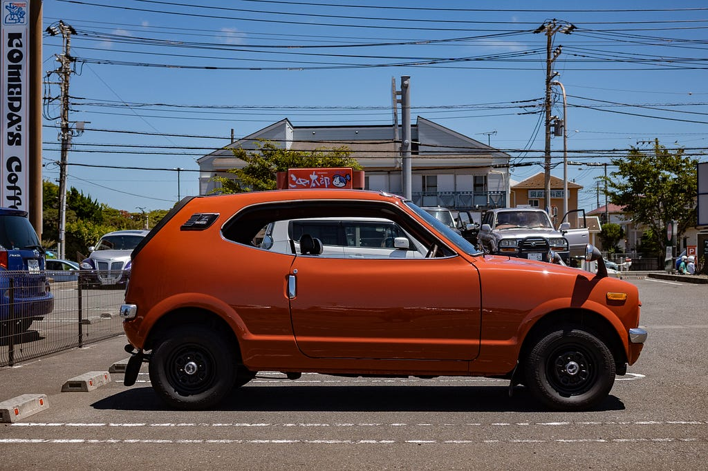
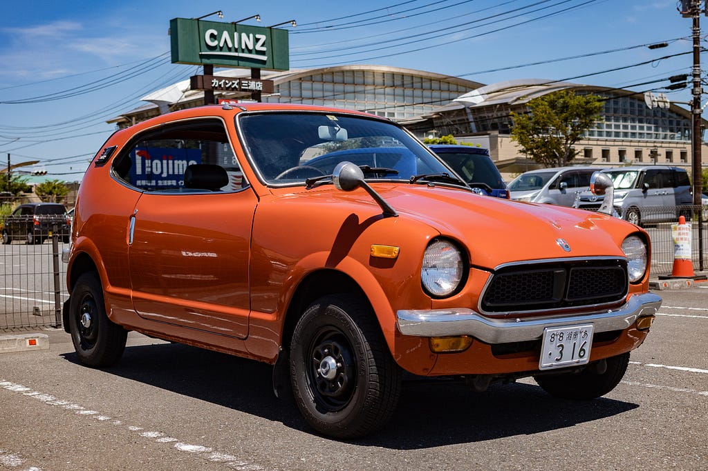
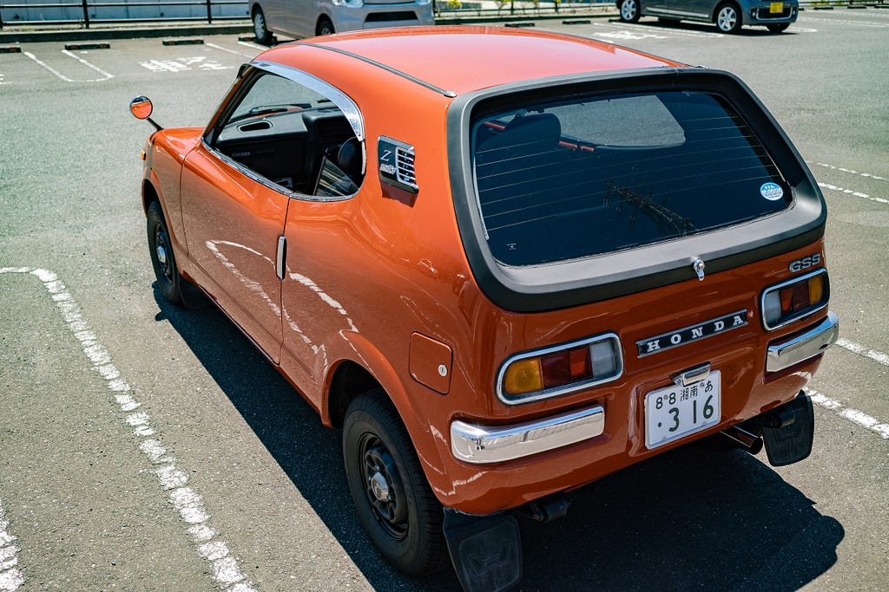
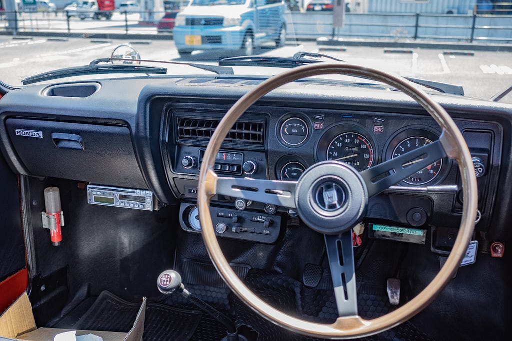

# HONDA Z GSS 1973

2023.09.18

ひょんなことで、「いつかZに乗りたいんですよね」という話をある人にしたら、「Z売りたい人いますよ？車見ます？」と言われて、見てしまったら、内外装はまあまあだけど、エンジンは調子良さそうでしかもGSS（五速の最上級グレード）だったし、ライトやらスイッチやらもほぼ問題なく動作するのでまあいいんじゃないか？ということで買ってしまった。

元々興味があったのは確かで、二台持ちするなら軽自動車じゃないと経済的にきついというのはあった。スバル360とか、キャロル、フロンテとかも好きだったし、ジムニーの昔のタイプも好みだったり。とは言えZは子供の頃から後姿が気になっていて、タイムガイコッツに似てるとずっと思っていた車だった。

ホンダは部品が全然出ないとか聞いた事もあったが、まあ何とかなるだろう的な見切り発車。持ち主は自分で車の整備工場を経営している人だったが、自分の車はメンテしないというか、壊れたらなんとかすればいいかと考えるパターンが多いと思うし、車検切れしていたので車検整備をお願いしたら、「自分ではしたくないが、このままで車検通ると思う。」などと言う。違和感を覚えつつ、それなら無理にこの人にお願いしない方がいいだろうなと、最初に紹介してくれた方に相談したら横須賀で英車を主にやってる人がたぶん診てくれると思うのでと話をしてくれて、そちらで車検整備をお願いした。

ブレーキ関係は結構キツイ状態だったらしく。いろいろあったようですがとりあえず必要だと思う部分は全部やってという雑なお願いをしてみたんですが、きちんとやってくれた上にヤフオクで落としたクラッチ板の交換も済ませてもらいました。本当はクラッチカバーやレリーズベアリングも交換したかったのですが、部品がなかったのでとりあえず。整備をしていただいた方も運転してみてエンジンは相当調子いいとのことだったのでラッキーだった。車検整備が終わって受け取ってから久しぶりのマニュアル車ということでドキドキしながら走り始めたけどやたら加速が鈍いのでおいおいこんな車と暮らしていけるのかしら？とちょっと絶望的な気分になっていたのですが、なんとかカインズの駐車場までたどり着き、ちょっと車関係の買い物をしてから駐車場内で運転の練習をしてみたら、この車は5速だけど1速は坂道や重たい物を乗せた時用くらいで普段は2速発進なのですが、2だと思って入れている位置が4速だっただけで、2速発進ならめっちゃいい感じで加速してくれました。安心。

*内装はかなり格好よいのではないか？*

そんなわけで、Novaはよく自分が部品交換などをお願いして不在になるのでそんな時に足や、近場の狭い道を通るような時はZで行こうと思っていますが、クーラーもないし、格好優先で三角窓もないので暑くて死にそうです。早く涼しくなって欲しいところ。

内装はかなり格好よいのではないか？と思っています。ハンドルは微妙な小径に変更されていたのでヤフオクでこの時代のものを探して付けてもらいました。面白いのがこのころのホンダは軽自動車のパーツと乗用車のパーツがおそらく工場で流れて来たものをそのまま付けたのでしょうか？ステアリングのスプライン系が29mmと27mmとあって同じ形のステアリングが付かなかったりするとかでヤフオクで質問して測ってもらったりして合うものを購入しました。Zはハンドル部分が黒だと思うのでこのステアリングはライフ用かもしれませんが、他のZ用のステアリングはひび割れているのばかりでキレイなのはこれしか売ってなかったので仕方ないかなと。

---

**使用画像**: honda-z-1.jpeg, honda-z-2.jpeg, honda-z-3.jpeg, honda-z-4.jpeg
