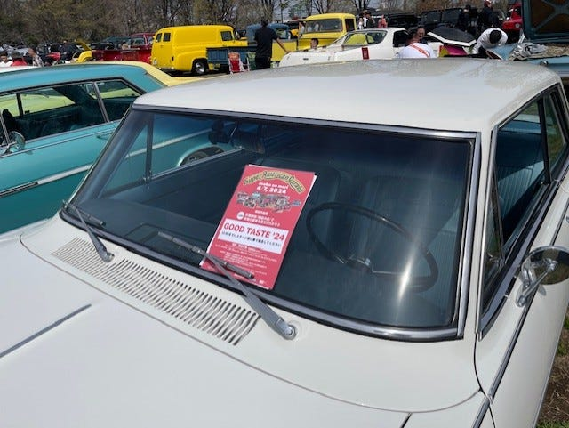

# Nova アワードをいただく

2024.12.10（2024年4月7日のイベント）

以前勤めていた会社の拠点が福島県いわき市にあったため、よく車で出張しては、好間家という峠の定食屋さんでかつ丼を食べていた。すごくおいしい記憶があって、定休日の月曜に出張だとガッカリしたことが何度もある。そんなお店が年末の28日で閉店になるというのでクリスマスの週末に行って来た。まずは土曜クリスマスイブの夕食にかつ丼を食べて、少し北上した広野という町で一泊。

…あ、これはJoban Highwayの記事だ。アワードの方を書く。

2024年4月7日の日曜に埼玉県の朝霞の森で行われたこじんまりしたアメ車のイベントでアワードをもらいました。知り合いと屋台でご飯を買ってあーだこーだ言いながら食べて戻って来たらこの紙がワイパーに挟んでありました。

*朝霞の森でのイベントでアワードを*

自分の車なるべくきれいには乗っているけれどNovaって地味な車なのでこういうのがもらえるとは思わず、うれしかったです。

アワードをとると、一台ずつステージに移動して紹介してもらえるのですが、自分の車はイベントに協賛している雑誌の推薦だったらしく、主催の方から「自分なら選ばないけど、○○誌の推薦なので」みたいな紹介のされ方をしてちょっとイラっとしましたが、まあいいやと。

偶然にも以前第三京浜の都筑PAで見かけたきれいなNovaの方とも知り合えていろいろ教えてもらえました。

---

**使用画像**: award.jpeg
