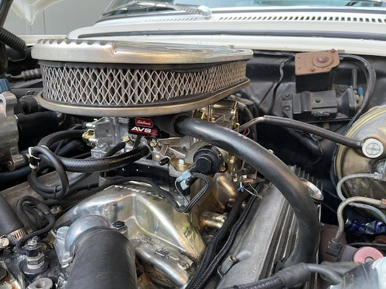
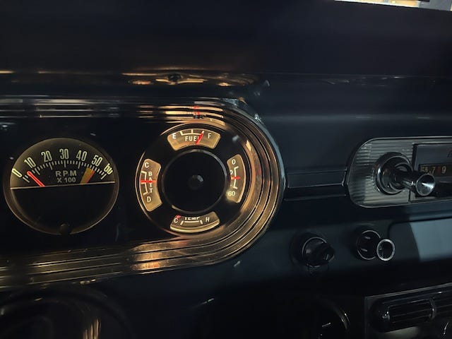
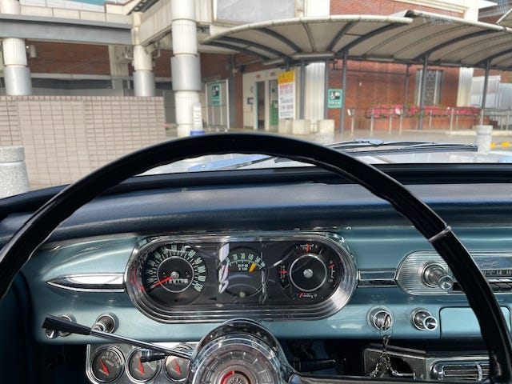
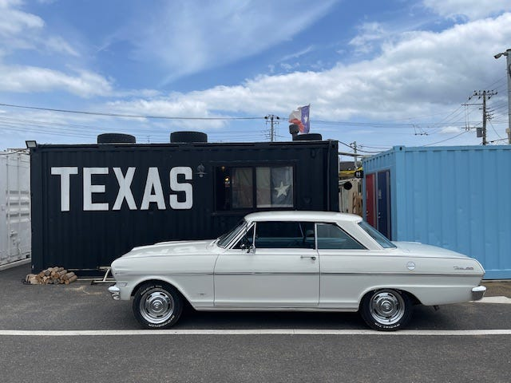

# キャブ交換、ゲージ交換

2024.12.10

2024年5月の作業

前回アイドリングの改善のためにいくつかの作業をしてもらったのですが、すっきりせず。修理工場と相談していたら同じEdelbrockで、AVS2というのに交換しちゃいましょうということになりました。

*AVS2というキャブ*

また、メーターゲージ内の右側、水温とかガスのメーターなどの部分が煤けていて照明も暗くて買った時から気になっていたのですが、eBayで見つけて少しでも円安のタイミングで購入。これも付け替えてもらいます。

*めっちゃ光るようになった*

この４つのコンビネーションのゲージなんですが、簡単ではなかったようで、上、右、左のメーターは稼働してますが、下のTEMPはセンサーと配線を既存の社外メーターと共用できないらしく今は動いていません。

*昼間の様子*

メーターゲージがきれいになると、運転中ずっと目に入る部分なので精神衛生上とてもいい感じです。1963年の車だと考えるとめっちゃきれいに見えます。この画像のウインカーレバーの下の3連メーターが、今回交換したメーターゲージ右側の内、ガス計以外を表示しています。念のためどちらも稼働させるようにしてもらいました。（社外メーターの方が表示が細かいので正確なのかも？と思って）

*T's BBQ*

いろいろいい感じになったのでうれしくて、千葉の成田空港のちょい手前。冨里にあるT's BBQまでNovaで行きました。めちゃくちゃ美味しいし、テキサス！っていう味なのでおすすめです。

---

**使用画像**: avs2-carb.jpeg, gauge-lit.jpeg, gauge-day.jpeg, ts-bbq.jpeg
