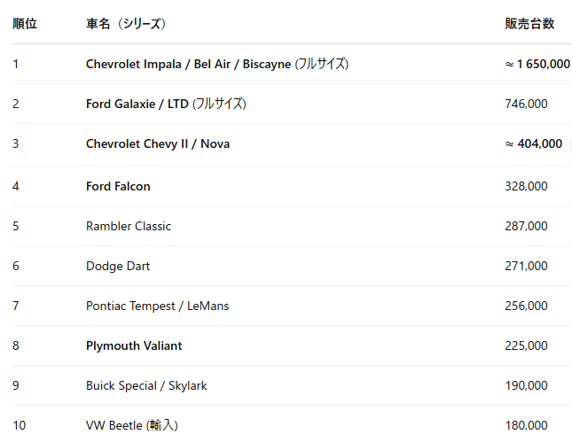
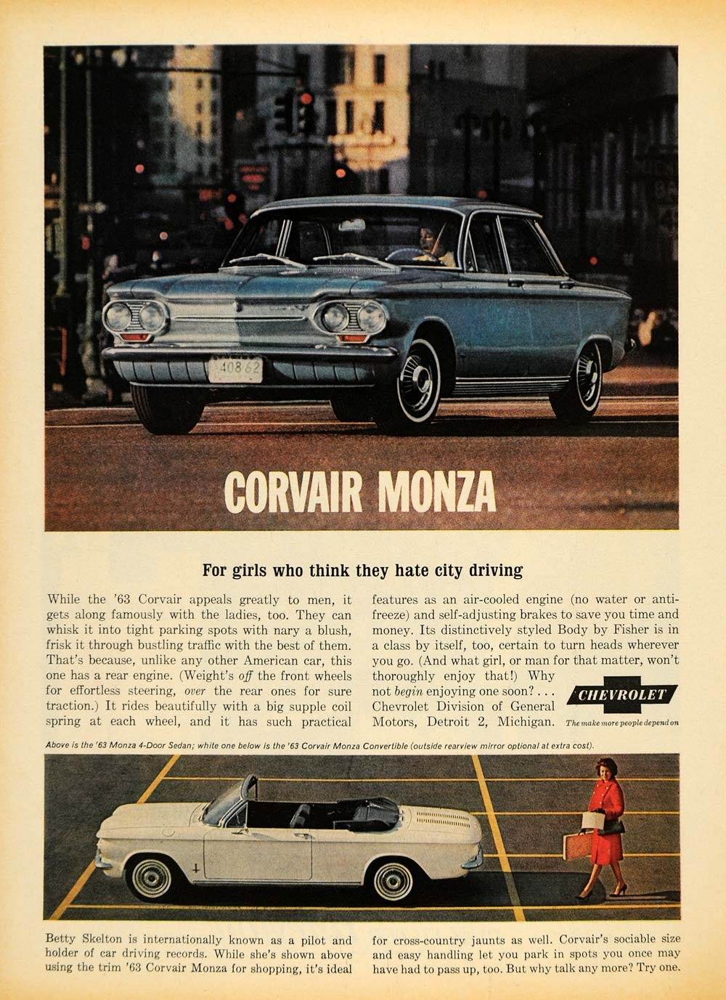
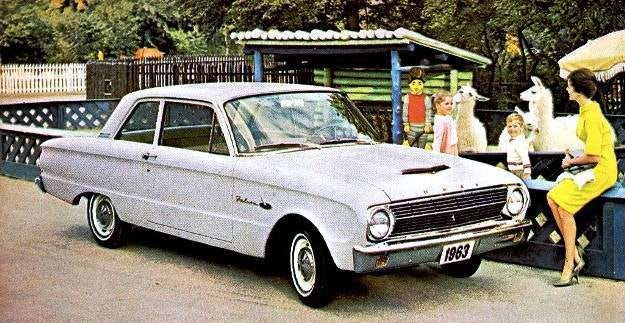
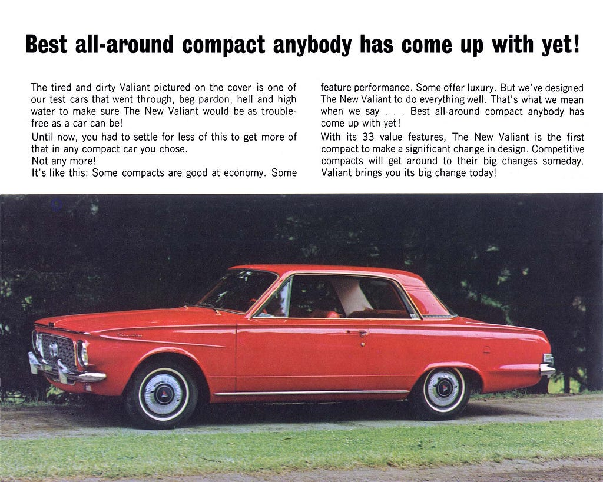
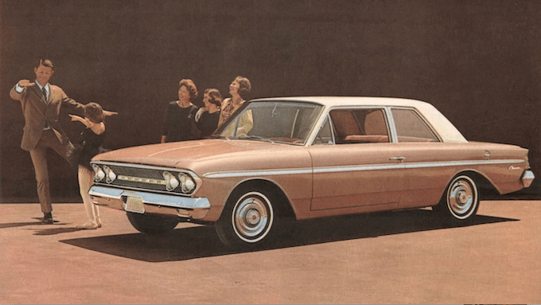
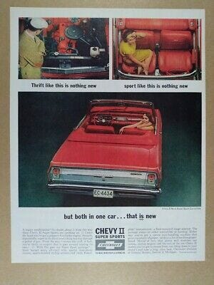

# 1963年の雰囲気

2025.04.19

## 「60 年代前半」って、実際どんな感じ？

1963年当時の世帯の中央値年収は 6,200 ドル。いまの貨幣価値に直すと 6 万ドルちょい。日本円にすると1000万円？結構高かったんですね。

1960年に1台以上の車を所有する世帯は78％。ほぼ各家庭に1台、人口1000人当たり396台の車があったという。通勤で父親が車を使い、奥さんが買い物に使うために二台目を持ち始めたという時代。ChevyIIの属するコンパクトカーはまさにそういうファミリー層の奥さんをターゲットにした車だった。

*1963 年 米国乗用車モデル別販売トップ 10*

ChevroletのImpala, Bel Air, Biscayneと、Ford Galaxieが1位2位を締め、ChevyIIとFalconが3位4位となっている。他のメーカーのコンパクトカーも見てみると20万台は売れていることがわかる。

## Corvair で滑って、Falcon に煽られた GM

GM は "先進的!" を狙ってリアエンジンの Corvair を投入（いま思えば超チャレンジ）。でも後輪サスペンションのクセが強すぎて、のちにラルフ・ネーダーにやり玉にあげられる。そこへ Ford Falcon が「フツーの FR」でズドンと大ヒット。

Chevy II は「このままでは市場を奪われてしまうので保守的な車を」と、ほぼ突貫で設計されたらしい。GM 社内では "falcon fighter" なんてあだ名が付いていたとか。

*Chevrolet Corvair*

*Ford Falcon*

*Plymouth Valiant*

*AMC Rambler Classic*

*Chevrolet ChevyII*

たいていの家庭は1台目に大き目の車を持ち、二台目にコンパクトカーを買うというのが当時のメーカーの考えた顧客層だった。なので女性が広告に登場するシーンが多かったりする。コンパクトなサイズ（と言っても日本だと3ナンバーサイズだが）も女性がスーパーマーケットの駐車場で取り回しが楽なようにということらしい。

---

**使用画像**: 1963-sales-top10.png, corvair.jpeg, falcon.jpg, valiant.jpeg, rambler.jpeg, chevyii.jpg
